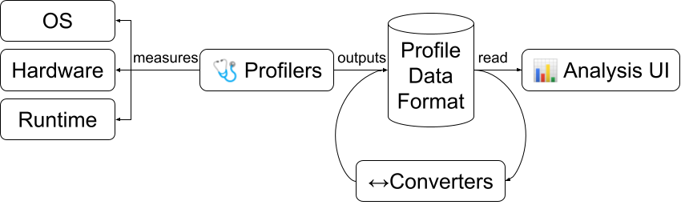

Profilerpedia is a catalog of Profilers, Profiler Data Formats they output, the
UIs that can analyse/visualise those data formats, and data format converters.

See the [announcement blog post](https://www.markhansen.co.nz/profilerpedia/).
